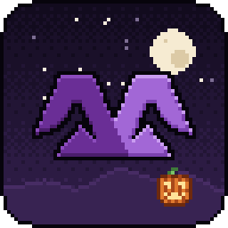

<p align="center">
  
</p>

<h1 align="center">Medirian Client</h1>

<p align="center">Klient Minecraft z własnym launcherem: HUD, moduły PvP, mody z Modrinth i CurseForge, wydajność — dla 1.8.9, 1.21.8, 1.21.11 i 26.3.</p>

<p align="center"><b>Pobierz:</b> Medirian Client → Windows → <code>MedirianClientSetup.exe</code> (strona pobierania: <code>website/</code>)</p>

---

## Co jest w repozytorium

| Część | Ścieżka | Technologia |
|---|---|---|
| **Medirian Launcher** | `launcher/` | Electron + React + TypeScript |
| **Medirian Shared** (rdzeń klienta, bez zależności od Minecrafta) | `client/shared/` | Java 8, Gson |
| **Adapter Minecraft 1.8.9** | `client/targets/mc-1.8.9/` | Legacy Fabric, Mixin, Java 8 |
| **Adapter Minecraft 1.21.11** | `client/targets/mc-1.21.11/` | Fabric, Mixin, Java 21 |
| **Adapter Minecraft 1.21.8** | `client/targets/mc-1.21.8/` | Fabric, Mixin, Java 21 (kopia 1.21.11 dla serwerów na 1.21.8) |
| **Adapter Minecraft 26.3** | `client/targets/mc-26.3/` | Fabric (bez obfuskacji, bez remapowania), Mixin, Java 25, SDL3 |
| Dokumentacja | `docs/ARCHITECTURE.md`, `docs/PROTOCOL.md`, `docs/RELEASING.md`, `TODO.md` | |
| CI i wydania | `.github/workflows/`, `scripts/` | GitHub Actions, Node |
| **Usługi Medirian** (konta, kosmetyki, profile w chmurze) | `backend/` | Node 22+, bez zależności — [docs/SERVICES.md](docs/SERVICES.md) |
| **Strona pobierania** (GitHub Pages) | `website/` | statyczny HTML/CSS/JS |
| Branding | `branding/` (źródłowe logo w `branding/source/`) | |

Pełny opis architektury i decyzji technologicznych: **[docs/ARCHITECTURE.md](docs/ARCHITECTURE.md)**.

## Wygląd

Medirian Client to klient w klimacie **cozy pixel-artowej nocy Halloween** — na stałe, nie sezonowo: fiolet z logo,
pomarańcz dyń, księżyc, mgła. Launcher i gra używają tej samej sceny, logo, ikon i palety, generowanych kodem przez
`node scripts/generate-pixel-art.mjs` (`scripts/pixel/`: scena, logo, 70+ ikon 16×16, własna czcionka Medirian Pixel).
W grze: własne menu główne, nowe Mod Menu (kafelki z ikonami modułów i lampką ON/OFF), wszystkie ekrany w stylu pixel art.

## Funkcje (0.3.0)

**Instalacja (Windows)** — `MedirianClientSetup.exe` instaluje Medirian Client dla bieżącego użytkownika bez uprawnień
administratora (`%LOCALAPPDATA%\Programs\Medirian Client\Medirian Client.exe`; opcjonalnie „dla wszystkich”), tworzy skrót
na pulpicie i w menu Start oraz wpis w „Aplikacje i funkcje” z deinstalatorem. Launcher aktualizuje się sam (electron-updater,
cicha instalacja w tym samym folderze); dane graczy w `MEDIRIAN_HOME` nie są ruszane przy instalacji, aktualizacji ani deinstalacji.

**Mody** — zakładka *Mods*: wyszukiwanie w Modrinth i CurseForge (oficjalne API), ikona, autor, opis, pobrania, kategorie,
sortowanie, paginacja; instalacja do wybranego profilu z wymaganymi zależnościami, sprawdzanie zgodności z wersją Minecrafta
i loaderem (Fabric / Legacy Fabric) z czytelnym komunikatem („Ten mod nie jest kompatybilny z Minecraft 1.8.9”), lista
zainstalowanych: włącz/wyłącz (`.jar.disabled`), usuń, aktualizacje, strona moda, zależności i „wymagany przez”.
Każdy profil ma własny folder gry (`MEDIRIAN_HOME/profiles/<profil>/` — mody, konfiguracja, światy), więc mody jednego
profilu nigdy nie trafiają do innego.

**Skin** — aktualny skin konta Minecraft (serwer sesji Mojang) w launcherze (model 3D na ekranie głównym i w oknie konta,
głowa w pasku) i w menu głównym gry; odświeżany przy zmianie konta, powrocie do launchera i co 10 minut. Bez konta lub
bez skina: domyślny skin Medirian.

**Launcher** — kreator pierwszego uruchomienia z diagnostyką i automatycznymi naprawami, automatyczna
instalacja Javy (Mojang: Java 8 dla 1.8.9, Java 21 dla 1.21.8 i 1.21.11, Java 25 dla 26.3), pobieranie i weryfikacja SHA-1 plików
gry, ponowne użycie assetów z istniejącego `.minecraft`, profile uruchomieniowe (wersja, RAM, Java,
argumenty JVM, rozdzielczość, profil konfiguracji Medirian), logowanie Microsoft (device code),
aktualizacje klienta z manifestu wydań (kanał stabilny / lokalny), automatyczna aktualizacja samego launchera, naprawa instalacji, czyszczenie cache,
podgląd logu gry, status gry na żywo (kanał launcher ↔ klient), changelog, Discord Rich Presence, animowana nocna scena (śnieg zimą), PL/EN/DE/ES.

**Klient** — własne menu główne, mod menu (zakładki kategorii, kafelki modułów z ikonami i lampką ON/OFF, strona ustawień modułu, wyszukiwarka), edytor HUD (przeciąganie,
przyciąganie z liniami pomocniczymi, skalowanie, panel właściwości, dodawanie/usuwanie, reset),
ustawienia globalne, profile konfiguracji (Default / PvP / Performance / własne) wspólne dla obu
wersji gry, powiadomienia, i18n PL/EN/DE/ES, śnieg zimą, kosmetyki (peleryny, czapki osadzone na głowie
i ukrywane pod hełmem, skrzydła, ślady, emotki), karta gracza ze skinem w menu głównym, konto Medirian
(logowanie kontem Minecraft przez handshake sesji Mojang) i profile w chmurze.

Moduły (41): CPS, Combo Counter, Reach Display, Target HUD, Hit Color, Health Tags, Toggle Sprint, Toggle Sneak, Zoom, Freelook,
Armor Status, Potion Effects, Coordinates, Custom Crosshair, Block Overlay, Hurt Camera, Fire Overlay, Item Physics, Fullbright, Time Changer, Weather Changer,
Scoreboard, Direction (kompas), Biome, Waypoints (punkty nawigacyjne), FPS, Keystrokes, Ping, Speed, Clock, Stopwatch, Session Info,
Dynamic FPS, Particle Control, Entity Culling (odległość + okluzja), Memory Monitor, FPS Graph, Chat (znaczniki czasu, scalanie
powtórzeń, dłuższa historia), Screenshot Tool, Auto GG, Server Info. Moduły zaplanowane (jeszcze bez UI): patrz [TODO.md](TODO.md).

## Zasoby zewnętrzne

* Czcionka **Lato** (Łukasz Dziedzic) — SIL Open Font License 1.1, plik licencji: `client/shared/src/main/resources/assets/medirian/fonts/OFL.txt`.
* Pozostałe grafiki (logo, peleryny, czapki, skrzydła, ikony) są oryginalne i generowane skryptami w `scripts/`.

## Wymagania deweloperskie

* **Node.js 22+** (launcher)
* **Java** — dowolna; Gradle sam pobiera właściwe JDK (21/25) przez *daemon JVM criteria*
  (`gradle/gradle-daemon-jvm.properties`), a toolchain Javy 8 dla `runClient` 1.8.9 przez foojay.
* Git, ~3 GB miejsca (cache Gradle/Loom, pliki gry).

## Budowanie

```bash
# 1. Klient: oba targety + manifest kanału lokalnego (distribution/)
node scripts/build-clients.mjs

# 2. Launcher
cd launcher
npm install
npm run dev          # tryb deweloperski (kanał "local" wskazuje na ../distribution)
npm run build        # typecheck + bundle
npm run dist         # instalator Windows: launcher/dist/MedirianClientSetup.exe (electron-builder, NSIS)
npm test             # testy jednostkowe launchera (mody, profile, skiny, aktualizacje, Discord)
```

Lokalny `npm run dist` nie ma kanału auto-aktualizacji ani wbudowanego URL manifestu klienta (to dodaje workflow wydań);
grę w takim buildzie uruchomisz po ustawieniu kanału w *Ustawienia → Aktualizacje*.

Pojedynczy target / testy:

```bash
cd client/shared && ./gradlew test            # testy jednostkowe rdzenia
cd client/targets/mc-1.21.11 && ./gradlew build
cd client/targets/mc-1.21.11 && ./gradlew runClient            # gra z Medirian (konto dev)
cd client/targets/mc-1.21.11 && ./gradlew runClient -Pselftest # zrzuty ekranów UI + audyt mixinów
```

`-Pselftest` przechodzi przez mod menu, edytor HUD, ustawienia i HUD w świecie, zapisuje zrzuty do
`run/screenshots/` i weryfikuje wszystkie wstrzyknięcia Mixin (`MixinEnvironment.audit()`).
Zrzuty menu porównuje z wzorcami `node scripts/visual-test.mjs` (`--update` zapisuje nowe wzorce);
`node scripts/check-selftest.mjs <log>` sprawdza log. Testy skryptów: `node --test scripts/test/`.

Automatyzacja launchera (tylko build deweloperski): `MEDIRIAN_DEV_CAPTURE=<dir>` robi zrzuty
wszystkich ekranów, `MEDIRIAN_DEV_LAUNCH=<profil>` uruchamia grę przez pełny pipeline instalacji
(szczegóły w `launcher/src/main/devAutomation.ts`).

## Konfiguracja wydania

| Zmienna | Gdzie | Znaczenie |
|---|---|---|
| `MEDIRIAN_MSA_CLIENT_ID` | build/uruchomienie launchera (lub *Ustawienia → Deweloperskie*) | identyfikator aplikacji Azure dla logowania Microsoft |
| `MEDIRIAN_MANIFEST_URL` / `MAIN_VITE_MANIFEST_URL` | uruchomienie / build launchera | domyślny URL manifestu wydań (kanał stabilny), gdy pole w ustawieniach jest puste |
| `MEDIRIAN_DISCORD_APP_ID` / `MAIN_VITE_DISCORD_APP_ID` | uruchomienie / build launchera (lub *Ustawienia → Discord*) | identyfikator aplikacji Discord dla Rich Presence |
| `MEDIRIAN_SERVICES_URL` / `MAIN_VITE_SERVICES_URL` | uruchomienie / build launchera (lub *Ustawienia → Deweloperskie*) | adres usług Medirian, przekazywany klientowi jako `-Dmedirian.api` |
| `MEDIRIAN_API_URL` | klient (bez launchera) | adres usług Medirian |
| `MEDIRIAN_CURSEFORGE_API_KEY` / `MAIN_VITE_CURSEFORGE_API_KEY` | uruchomienie / build launchera (lub *Ustawienia → Mody*) | klucz API CurseForge dla zakładki Mods (Modrinth działa bez klucza) |
| `MEDIRIAN_HOME` | launcher i klient | zmiana folderu danych (domyślnie `%APPDATA%\.medirian`) |

**Logowanie Microsoft** wymaga własnej rejestracji aplikacji w Azure (konta osobiste, przepływ
„device code”, uprawnienie `XboxLive.signin`) oraz zatwierdzenia przez Mojang dostępu do API Minecraft
Services — to wymóg Mojang dla każdego launchera. Do tego czasu build deweloperski udostępnia konto
offline do testów w singleplayer.

**Discord Rich Presence** wymaga aplikacji w [Discord Developer Portal](https://discord.com/developers/applications)
(nazwa aplikacji = nazwa widoczna na profilu, np. „Medirian Client”). W *Rich Presence → Art Assets* dodaj
`branding/medirian-icon-512.png` pod nazwą `medirian`. Identyfikator aplikacji wpisz w launcherze lub wbuduj
przez `MAIN_VITE_DISCORD_APP_ID`. Launcher łączy się z lokalnym Discordem (named pipe / unix socket) i pokazuje
wersję gry, profil Medirian, menu / singleplayer / serwer (adres można ukryć) oraz czas gry.

**CurseForge** wymaga klucza API: załóż konto w [CurseForge for Studios](https://console.curseforge.com/),
utwórz klucz (*API keys*) i wpisz go w *Ustawienia → Mody* albo wbuduj w wydania jako sekret repozytorium
`CURSEFORGE_API_KEY` (workflow przekazuje go jako `MAIN_VITE_CURSEFORGE_API_KEY`). Bez klucza zakładka Mods pokazuje
„CurseForge wymaga klucza API” i działa z Modrinth. Pliki, których autorzy zablokowali pobieranie przez inne aplikacje,
launcher otwiera na stronie CurseForge zamiast je pobierać.

**Podpis cyfrowy (Windows)**: bez certyfikatu Authenticode instalator jest niepodpisany — SmartScreen pokaże ostrzeżenie, a
Windows 11 z włączonym *Smart App Control* może zablokować instalator, aplikację lub deinstalator. Do publicznej dystrybucji
potrzebny jest certyfikat (sekrety `CSC_LINK` / `CSC_KEY_PASSWORD`, patrz [docs/RELEASING.md](docs/RELEASING.md)).

**Publikacja**: tag `v<wersja>` uruchamia `.github/workflows/release.yml` — jary, manifest, instalatory launchera
i kanał jego auto-aktualizacji trafiają do GitHub Releases (szczegóły i sekrety podpisywania: [docs/RELEASING.md](docs/RELEASING.md)).
Własny serwer: `node scripts/build-clients.mjs --base-url https://twoj-cdn/medirian/0.3.0/`, wgraj
zawartość `distribution/` pod ten adres i ustaw URL manifestu w launcherze.

**Strona pobierania**: `.github/workflows/pages.yml` publikuje `website/` na GitHub Pages (jednorazowo: *Settings → Pages →
Source: GitHub Actions*). Przycisk „Pobierz dla Windows” prowadzi do
`https://github.com/<repo>/releases/latest/download/MedirianClientSetup.exe`, więc zawsze daje najnowszy instalator.

## Struktura danych

Launcher i klient współdzielą `MEDIRIAN_HOME` — opis plików i protokołu: [docs/PROTOCOL.md](docs/PROTOCOL.md).
